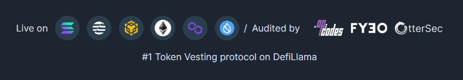

# Welcome to Streamflow

**About Streamflow**

**Streamflow** is a token operations platform which enables organizations to handle their funds entirely on-chain. Streamflow helps teams automate, cut costs and enhance transparency using programmable payments via:

* Token vesting
* Payroll
* Token locks&#x20;

Streamflow is trusted and used by over 50 teams across all supported chains including: UXD, Hubble, Ratio, Heavenland, Honeyland, Genopets, Bonk, Rain, GRAPE and many more.&#x20;

**Streamflow Protocol**

Streamflow also maintains an [SDK](broken-reference) that allows teams to integrate programmable payments into any app, allowing for the exploration of innovative value transfer and fund distribution methods.&#x20;

Streamflow aims to provide a diverse range of projects with access to payment infrastructure and is available for use on the following blockchains:

* Solana
* Ethereum
* Polygon
* Aptos&#x20;
* BNB Chain
* Sui

<figure><figcaption></figcaption></figure>

### Browse By Product


[token-vesting.md](basics/token-vesting.md)



[stream-payments.md](basics/stream-payments.md)



[token-lock.md](basics/token-lock.md)

