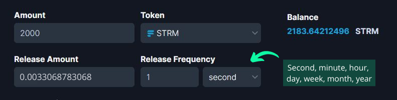

# 💰 Streaming Payments

Streaming payments on Streamflow are an efficient, easy to use, and secure way of payroll management.\
\
The powerful and configurable features of the Streamflow app let you stream payments to employees, freelancers, service providers, and contractors as per your requirements.\
\
Let’s go through a step-by-step process of setting up payroll streams using Streamflow.

#### Step 1: Connect the wallet

Firstly, you need to visit the Streamflow app via the following URL:

👉 [app.streamflow.finance](https://bit.ly/3igHaDj)

Next, you will have to connect the wallet to start using the app. Streamflow supports multiple wallet providers, such as Phantom, Solfare, Slope, and Sollet. After connecting the wallet, make sure to switch to the ‘ New Stream’ page for creating a payroll stream.

#### Step 2: **Stream amount and release rate**

Now, you can choose any token of your choice for the stream and enter the total amount to be streamed into the given tab. Streamflow supports all SPL tokens for payroll streams, like USDC, USDT, SOL, etc. Next, you will need to specify the total amount that you want to lock into the payroll stream, later you will also get a top-up option to add more funds to a live payroll stream.

Release frequency will determine how often locked tokens in the stream are going to be released, and the release amount is the number of tokens that will be released at the set frequency of release. Let’s try to understand this with an example.

Let’s say an employee’s weekly salary is 2000 STRM, either you can choose the old school way of releasing 2000 STRM at the end of each week by setting the release frequency to one week and the release amount to 2000 STRM, or you can proportionally breakdown the total salary amount into smaller amounts and release that in smaller time units like X number of seconds, minutes, hours, and days.

To stream the 2000 STRM weekly salary in nearly real-time, you will have to set the release rate to 0.00330687830 STRM and the **** release frequency to one second, as shown in the screenshot.

#### Step 3: Contract title, recipient address, and (optional) email address

The subject of the payroll stream needs to be entered in the 'contract title' tab, and the wallet address of the recipient can be pasted in the address field. We recommend using a non-custodial wallet address for the recipient, such as Phantom, Solfare, and Slope wallet. However, if you still want to use a centralized exchange's wallet address for the recipient, make sure to turn on the automatic withdrawal.\
\
Optionally, you can also add the email address of the recipient, an email is sent to the recipient regarding the creation of the payroll stream. Additionally, the recipient gets notified when unlocked tokens are transferred into his/her wallet.      &#x20;

#### Step 4: Start time & Cancel/Transfer permissions

You can select the start date and time from the payroll stream from the given tabs, the end date/time of the stream will automatically be calculated based on the total amount and release rate of the tokens.\
\
You can also choose who gets the authority to cancel or transfer the payroll stream from the sender/recipient. Please grant these permissions carefully because you can not change cancel and transfer permissions once a payroll stream has gone live.            &#x20;

#### Step 5: Automatic withdrawal and (optional) referral address

Automatic withdrawal is a quite handy feature, it will automatically transfer the unlocked tokens into the recipient’s wallet at the set frequency. It is not compulsory to enable auto-withdrawal, the recipient can also connect the wallet to the Streamflow app and manually withdraw the unlocked funds by interacting with the incoming payroll stream.

&#x20;In case someone referred you to Streamflow, just paste the wallet address of the referrer in the referral address tab, and a portion of the service fees will be sent to that address as a reward.&#x20;

.png>)

#### Step 6: Create the payroll stream

Take a look at the overview tab to see the parameters of your payroll stream, such as start and end date/time, total amount, release rate, etc.

Finally, click on the 'create streaming contract' button and approve the transaction in your wallet, your streaming contract will go live on the Solana network as soon as the transaction is confirmed.\
\
Please note that if you have added the recipient's email address, you will get an additional wallet pop-up to sign the message. In other words, it is simply an approval for sending email notifications.

.png>)

#### Email notifications

If the recipient's email address has been added during the creation of the payroll stream, an email will be sent to the given address with all the details about the stream.

.png>)

Additionally, the recipient will get notified when unlocked funds are transferred into his/her wallet. Please keep in mind that adding the recipient's email address is an optional feature and it can only be added while creating the payroll stream.

#### Managing existing payroll streams

The sender will be able to see and interact with the payroll stream on the 'outgoing streams' page. Please keep in mind that you will have to click on the three dots (...) right below the 'actions' heading to see the options to interact with the stream.\
\
As a sender, you will get the option to top up the stream at any point in time before its expiration. Depending on the permissions granted while creating the stream, the sender might also get the option to cancel or transfer the stream.

The recipient will be able to see and interact with the payroll stream on the 'incoming streams' page. As a recipient, you will get the option to withdraw the unlocked amount at any point in time. Depending on the permissions granted while creating the stream, the recipient might also get the option to cancel or transfer the stream.

#### How to top up an existing payroll stream

By using the top-up feature, the sender can always add more funds to an ongoing payroll stream before its expiration. Just click on the three dots (...) right below the 'actions' heading on your outgoing stream and choose the top-up option. Next, enter the amount that you want to add, and approve the transaction in your wallet.

The following screenshot shows the extension of the end time and date after the top-up, the total amount of the stream has also been updated.

#### How to manually withdraw the payment

The recipient can manually withdraw the unlocked tokens into his/her wallet at any point in time, just click on the withdraw button, select the amount, and approve the transaction.&#x20;

In case auto-withdrawal has been enabled by the sender while creating the payroll stream, the recipient will not need to connect the wallet to the Streamflow app to manually withdraw the unlocked funds from the payment stream.

.png>)

.png>)

#### How to transfer a payroll stream

Depending on the permissions granted while creating the stream, the sender/recipient might get an option to transfer the payroll stream. Just click on the transfer button, enter the new wallet address for the recipient, and approve the transaction. The transfer option can be useful both for changing the wallet address of the existing recipient or transferring the stream to a completely new recipient.\
\
When a stream is transferred, the payroll stream gets transferred to the new address with both the locked amount in the stream, as well as the unlocked amount of tokens that have not been withdrawn by the previous recipient.

.png>)

#### How to cancel a payroll stream

Depending on the permissions granted while creating the stream, the sender/recipient might get an option to cancel the payroll stream. \
\
When a payroll stream is canceled, the amount that has not been unlocked yet is returned to the sender, whereas the unlocked amount is automatically withdrawn into the recipient's wallet.

You are now all set to create and manage payroll streams on the powerful Streamflow app. In case you get stuck at any point, feel free to reach out to us in Streamflow discord. The Streamflow product suite will expand over time and we will also keep on adding new features to our existing products.

### Video tutorial on Streaming payments


Streaming payments


