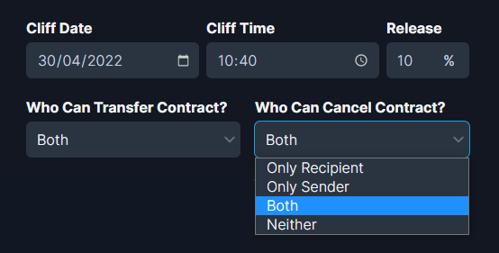

# 💰 Token Vesting

Streamflow token vesting app is the most efficient way to vest SPL tokens to investors, teams, and communities.

Let’s go through a step-by-step process of creating a vesting contract using Streamflow.

#### Step 1: Connect the wallet

Firstly, you need to visit the Streamflow app via the following URL:

👉 [app.streamflow.finance](https://bit.ly/3igHaDj)

Next, you will have to connect the wallet to start using the app. Streamflow supports multiple wallet providers, such as Phantom, Solfare, Slope, and Sollet.

#### Step 2: **Vesting amount, recipient address, and (optional) email address**

Select the token of your choice that you want to vest, and enter the total number of tokens to be vested into the amount tab. \
\
Next, you can paste the recipient's wallet address into the given field. We recommend using a non-custodial wallet address for the recipient, such as Phantom, Solfare, and Slope wallet. However, if you still want to use a centralized exchange's wallet address for the recipient, make sure to turn on the automatic withdrawal.\
\
Optionally, you can also add the recipient's email address, an email is sent to the recipient regarding the creation of the vesting contract. Additionally, the recipient gets notified when unlocked tokens are transferred into the wallet.                  &#x20;

.png>)

#### Step 3: **Contract title, vesting duration, and release frequency**

The subject of the vesting contract can be typed in the contract title tab. The vesting duration of the contract is an important parameter, you can choose the start date/time and end date/time of the vesting contract from the respective tabs.\
\
Release frequency can be chosen in the form of different time units, such as second, minute, hour, day, week, month, and year. A proportional amount of the vested tokens will be released in accordance with release frequency.              &#x20;

.png>)

#### Step 4: **Cliff time release and cancel/transfer permission**

By using the cliff time release feature, a certain percentage of the total vested tokens can be released with the first flow/unlock of the vested funds.\
\
&#x20;For example, if you set the cliff time release at 10%, ten percent of the total vested tokens will be released as soon as the vesting contract starts streaming tokens, and the recipient will immediately be able to withdraw those unlocked tokens. **** The remaining vested amount will be streamed at a constant rate for the rest of the vesting duration.\
****\
****Let’s say you create a vesting contract with a total amount of 200 STRM tokens using a cliff release of 10 percent.

This means that 20 STRM (10% OF 200 STRM) will get unlocked as soon as the vesting contract starts streaming, and the remaining vested amount (180 STRM) will be streamed at a constant rate (in accordance with the release frequency) for the rest of the vesting duration.

**Moving on to cancel/transfer permissions**, you can choose who gets the authority to cancel or **** transfer **** the vesting contract from the sender/recipient. Please grant these permissions carefully because you can not change cancel and transfer permissions once a contract has gone live.            &#x20;

#### Step 5: Automatic withdrawal, referral address, and overview

Automatic withdrawal is a quite handy feature, it will automatically transfer the unlocked tokens into the recipient’s wallet at the set frequency. It is not compulsory to enable auto-withdrawal, the recipient can also connect the wallet to the Streamflow app and manually withdraw the unlocked funds by interacting with the incoming vesting contract stream.

In case someone referred you to Streamflow token vesting, just paste the wallet address of the referrer into the referral address tab. A decent portion of the service fees will be sent to the referral address as a reward.              &#x20;

Finally, take a look at the overview tab to see all the parameters of your vesting contract, click on the 'create vesting contract' button, and approve the transaction in your wallet. Your vesting contract will go live on the Solana network as soon as the transaction is confirmed.\
\
Please note that if you have added the recipient's email address, you will get an additional wallet pop-up to sign the message. In other words, it is simply an approval for sending email notifications.

#### Email notifications

If the recipient's email address has been added while creating the contract, an email will be sent to the given address with all the details about the vesting contract.

.png>)

Additionally, the recipient will get notified when unlocked funds are transferred into his/her wallet. Please keep in mind that adding the recipient's email address is an optional feature and it can only be added while creating the contract.

#### Managing live vesting contracts

The sender will be able to see and interact with the vesting contract on the 'outgoing streams' page. Please keep in mind that you will have to click on the three dots (...) right below the 'actions' heading to see the options to interact with the stream.\
\
Depending on the permissions granted while creating the vesting contract, the sender might also get the option to cancel or transfer the stream.

.png>)

The recipient will be able to see and interact with the vesting contract on the 'incoming streams' page. As a recipient, you will get the option to withdraw the unlocked amount at any point in time. Depending on the permissions granted while creating the vesting contract, the recipient might also get the option to cancel or transfer the stream.

#### How to manually withdraw the unlocked amount

The recipient can manually withdraw the unlocked tokens into his/her wallet at any point in time, just click on the withdraw button, select the amount, and approve the transaction.&#x20;

In case auto-withdrawal has been enabled by the sender while creating the contract, the recipient will not need to connect the wallet to the Streamflow app to manually withdraw the unlocked funds from the vesting contract.

.png>)

#### How to transfer a vesting contract

Depending on the permissions granted while creating the vesting contract, the sender/recipient might get an option to transfer the contract. Just click on the transfer button, enter the new wallet address for the recipient, and approve the transaction. The transfer option can be useful both for changing the wallet address of the existing recipient or transferring the contract to a completely new recipient.\
\
When a vesting contract is transferred, the contract gets transferred to the new address with both the locked amount as well as the unlocked amount of tokens that have not been withdrawn by the previous recipient.

.png>)

#### How to cancel a vesting contract

Depending on the permissions granted while creating the vesting contract, the sender/recipient might get an option to cancel the contract.\
\
When a vesting contract is canceled, the amount that has not been unlocked yet is returned to the sender, whereas the unlocked amount is automatically withdrawn into the recipient's wallet.

You are now all set to create and manage vesting contracts on the powerful Streamflow app. In case you get stuck at any point, feel free to reach out to us in Streamflow discord. The Streamflow product suite will expand over time and we will also keep on adding new features to our existing products.

&#x20;

### Video tutorial on Token Vesting


Creating vesting contracts in bulk + email notifications



How to use Token Vesting on StreamFlow Finance

