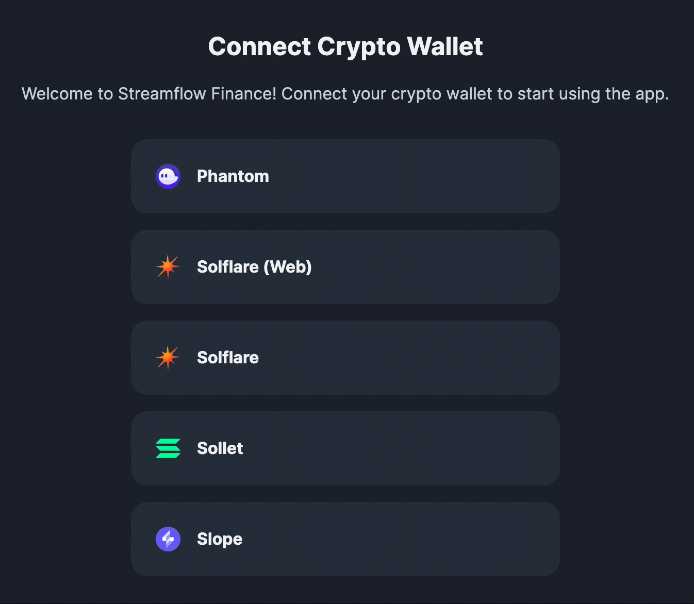
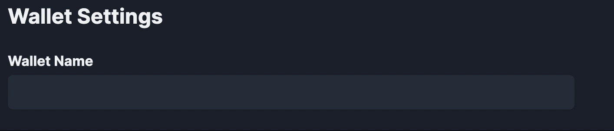
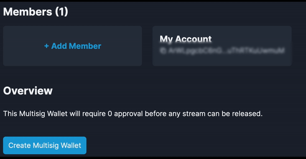
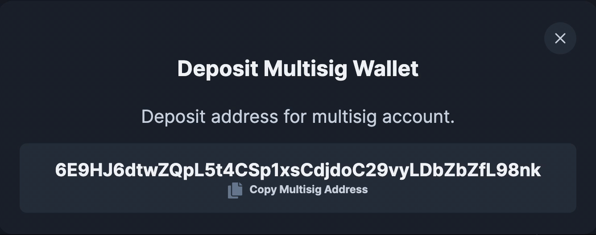
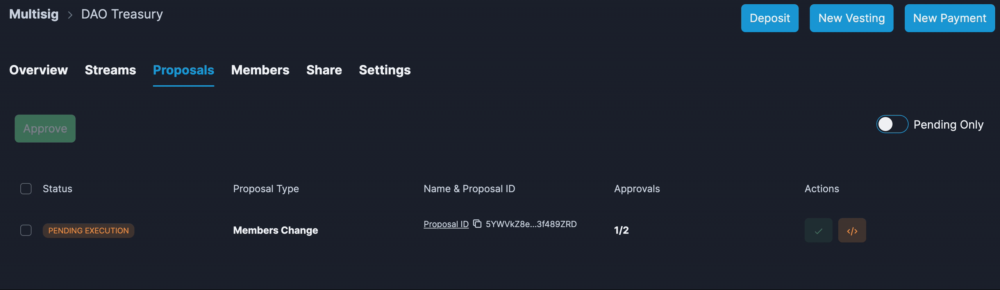

# 💰 How to set up a multisig beta wallet

Here’s a step-by-step walkthrough to creating a Streamflow multisig:

**Step 1: Connect Wallet**

To begin, connect your Wallet to the Streamflow app. Streamflow supports multiple wallet providers including Phantom, Slope, Sollet, and Solfare.

<figure><figcaption></figcaption></figure>

**Step 2: Name multisig Wallet**

Click on the “multisig wallet tab,” and give your wallet a descriptive name so members can easily identify its purpose.

<figure><figcaption></figcaption></figure>

**Step 3: Add members**

Add members by copying and pasting their wallet addresses. Be sure to enter member names to keep track of which wallet belongs to which member.

<figure><figcaption></figcaption></figure>

**Step 4: Set the number of approvals needed for proposals**

Set the number of members needed to complete a transaction. For instance, if you have three members you can require two of those three to approve a transaction. You can also require one member or all three members to come together to approve a transaction depending on your needs.

<figure><figcaption></figcaption></figure>

**Step 5: Deposit funds**

Copy the multisig wallet address and use a previously created wallet to fund your multisig.

<figure><figcaption></figcaption></figure>

**Step 6: Manage Multisig via proposals**

When you Initiate a stream, add a new member, or change the name of the multisig wallet an accompanying proposal is created. Members must vote on each proposal in order to make changes to the multisig wallet.

<figure><figcaption></figcaption></figure>

**List of supported proposals types:**

* Add and remove members
* Update wallet name
* Create vesting & payroll streams
* Adjust the approval threshold

**Conclusion**

Congrats anon, you’re ready to create proposals and initiate secure streams to recipient wallets! 🎉

If you run into any issues hop on our Discord and the team will be happy to help you out and get the issues resolved!

