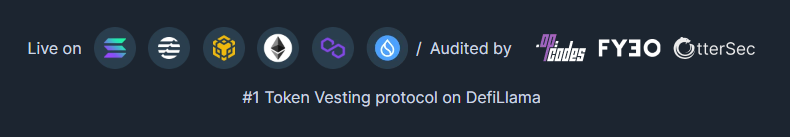

# 📊 Token Vesting

<figure><figcaption>
Streamflow token vesting
</figcaption></figure>

Create token vesting contracts to lock up and distribute tokens to stakeholders and other recipients on a custom schedule. Token vesting with Streamflow grants you access to features like cliff dates, transferrable streams, automatic withdrawals, bulk contracts and much more. \
\
Recipients of vesting contracts can view the progressing schedule and claim tokens from our unified dashboard, minimizing friction for recipients while adding a layer of transparency.\
\
We support both linear and non-linear vesting schedules.&#x20;

Our fully featured token vesting product includes a number of helpful features:

* **Automatic claim:** Set the streamed tokens to be automatically dropped into the recipient's wallet, no need for the recipient to claim tokens manually\

* **Batch payments (with CSV Upload):** Create a contract with many recipients, either by manually adding the additional recipients you require or by uploading a CSV with all the recipients and their addresses, our CSV Upload feature takes care of the rest!\

* **Email notifications:** notify recipients of vesting contracts at each unlock.\

* **Public Dashboard:** Our public dashboard feature lets teams showcase all the token vesting and lock contracts to community and investors to be more transparent.\

* **SDK integration:** Streamflow SDK supports multiple chains for integration \
  \
  The UI of the Streamflow app is super elegant, user friendly and highly configurable :

<figure><figcaption>
Streamflow app UI
</figcaption></figure>

<figure><figcaption>
Streamflow app UI
</figcaption></figure>

<figure><figcaption>
Streamflow app UI 
</figcaption></figure>

For instructions on how to set up vesting contracts using the Streamflow app, see [this guide](https://docs.streamflow.finance/help/tutorials/token-vesting).\
\
**Book a call with us for live demo of app for your vesting schedule:** [Streamflow Calendly](https://calendly.com/streamflow-bd/token-vesting?month=2023-09\&date=2023-09-29)\
\
Visit our app to get started with token vesting:


Streamflow app


