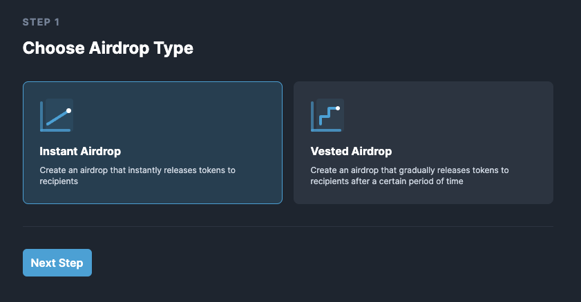

# Create a Payment Contract

Progressive unlock payments on Streamflow are an efficient, easy to use, and secure way of payroll management.\
\
The powerful and configurable features of the Streamflow app let you unlock payments to employees, freelancers, service providers, and contractors as per your requirements.\
\
Let’s go through a step-by-step process of setting up payroll contracts using Streamflow.

#### Step 1: Connect the wallet

Firstly, you need to visit the Streamflow app via the following URL:

👉 [app.streamflow.finance](https://bit.ly/3igHaDj)

Next, you will have to connect the wallet to start using the app. Streamflow supports multiple wallet providers, such as Phantom, Metamask, Solflare and many more. After connecting the wallet, make sure to switch to the "Payment" and click "Create New"

#### Step 2: **Token and unlock frequency and start date**

Now, you can choose any token of your choice for the contract as well as the duration. 

**"Unlock Schedule"** will determine how often locked tokens in the contract are going to be released.

Next you can choose whether you want to have the contract begin immediately when it's created, or to schedule it for the future. 

<figure><figcaption></figcaption></figure>

#### Step 3: Advanced settings

With **Auto-Claim** you can automate the need for the recipient to claim their tokens as they unlock. Instead the unlocked tokens are directly dropped into the recipients wallet. The sender will pay the fees for these transactions.&#x20;

.png>)  &#x20;

Lastly, you can select who can cancel the contract as well as who can transfer and change the recipient address.&#x20;

**Step 4: Recipient and amount**

Next you'll need to input the amount being sent and the recipients wallet address. At this point you can also add a title for the contract to more easily keep tabs on which contract applies to which recipient. Lastly you can add an email address of the recipient, that way the recipient will recieve email notifications around the contract updates.&#x20;

&#x20;         .png>)

#### Step 5: Review

Next you'll land on the review page, where you can check the graph to confirm it matches your configuration expectations.

.png>)

Below you'll find some key details around the contract including:

1. Number of recipients
2. Total amount of tokens to be deployed to the contracts
3. Streamflow fees&#x20;

<figure><figcaption></figcaption></figure>

Below the high level information you can find all the configuration information about the contract you've created as well as our fees once more.&#x20;

<figure><figcaption></figcaption></figure>

#### Step 6: Create the payment contract

Finally, click on the 'Create Payment Contract' button and approve the transaction in your wallet - congratulations, you've just created you're first contract on Streamflow.   \
.png>)

#### Email notifications

If the recipient's email address has been added during the creation of the payroll stream, an email will be sent to the given address with all the details about the stream.

Additionally, the recipient will get notified when unlocked funds are transferred into his/her wallet.&#x20;

Please keep in mind that adding the recipient's email address is an optional feature and it can only be added while creating the contract.

####
